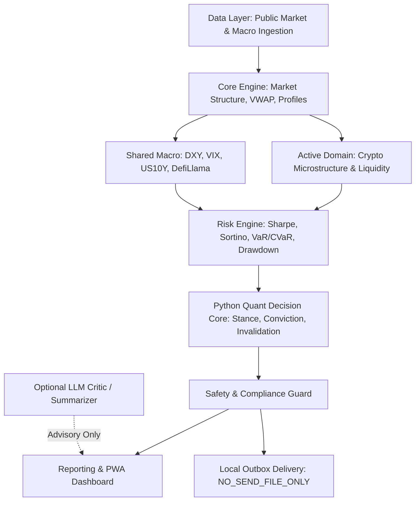

# OpenBagus

[](https://www.python.org/downloads/)
[](#)
[](#)
[](#)
[](#)

**OpenBagus** is a modular, domain-neutral quantitative intelligence and market research platform. Designed for long-term multi-asset extensibility, OpenBagus separates core analytical engines, risk modeling, and data pipelines from specific market domains.

In this primary phase, the **active domain is exclusively Crypto** (BTC, ETH, SOL) alongside shared cross-asset macro indicators. All equity and stock-specific pipelines are deactivated.

---

## 1. Architectural Philosophy

OpenBagus operates under strict institutional design boundaries:



1. **Umbrella Platform:** `OpenBagus` is not locked into any single asset class. Future domains (equities, commodities, forex, rates) can plug into the existing architecture without refactoring the core.
2. **Python Quant Core:** Numerical decisions, market regimes, conviction scores, invalidation levels, and portfolio stances are strictly computed in Python. LLMs **never** act as the numerical decision core.
3. **CLI + Email:** The supported operational interfaces are the Python CLI and provider-neutral SMTP email.
4. **Safety & Zero-Execution:** The platform executes **zero** live exchange or broker orders. Default communication mode is `NO_SEND_FILE_ONLY` (all reports are staged to local files).
5. **Exact Manual Trigger:** Interactive requests must use the exact trigger `OpenBagus`. Spaced variants (`Open Bagus`) or aliases are strictly rejected.

---

## 2. Directory Structure

```
OpenBagus/
├── config/                 # Domain-neutral runtime and source quality configurations
├── openbagus/              # Main modular Python package
│   ├── core/               # Generic contracts, guards, VWAP, Volume Profile, market structure
│   ├── domains/
│   │   └── crypto/         # Active crypto microstructure, order flow, liquidity metrics
│   ├── intelligence/
│   │   ├── macro/          # Shared macro scenarios (DXY, VIX, US10Y, commodities)
│   │   ├── news/           # Narrative tracking, dedup ranker, memory
│   │   ├── sentiment/      # Cross-asset sentiment scoring
│   │   └── llm/            # Advisory LLM router and critic prompts
│   ├── risk/               # Sharpe, Sortino, VaR, CVaR, Monte Carlo, Max Drawdown
│   ├── data/               # Public ingestion engine (Binance, CoinGecko, Yahoo, DefiLlama, DuckDB)
│   ├── analysis/           # Quantitative research decision core & quality agent
│   ├── reporting/          # Briefs, Gmail HTML reports, printable views, PWA dashboard
│   ├── delivery/           # Safety guards, local outbox, MIME, and SMTP transport
│   ├── storage/            # Historical CSV/JSON logging & spreadsheet exporters
│   └── runtime/            # Pipeline orchestrator and scheduler governance
├── openbagus_finance/      # Backward-compatibility shims for legacy callers
├── scripts/                # Execution entrypoints, validators, and dashboard server
├── docs/                   # Architectural blueprints and migration records
├── reports/runtime/        # Generated runtime reports, outbox staging, and web dashboard
└── tests/                  # Unit and integration test suite
```

---

## 3. Quickstart & Installation

### Requirements
- Python 3.11, 3.12, 3.13, or 3.14
- Standard scientific Python packages (`numpy`, `pandas`, `scipy`)

### Setup
```bash
# Clone the repository
git clone https://github.com/Codingin02/openbagus.git
cd openbagus

# Install dependencies
pip install -r requirements.txt
```

---

## 4. Running the Platform

### A. Check Local Configuration
Runs network-independent checks for Python, imports, domains, data sources, email configuration, and runtime output access:
```bash
python -m openbagus doctor
```

### B. Run End-to-End Crypto Research Pipeline
Executes public data ingestion, quantitative analysis, local history persistence, and outbox staging:
```bash
python -m openbagus crypto-daily
```

### C. Generate an Email Draft
Creates text, HTML, EML, and a print-ready HTML attachment without sending:
```bash
python -m openbagus email --email-action draft
```

Validate SMTP configuration without network access:
```bash
python -m openbagus email --email-action check
```

### D. Manual Research Query
Execute a manual query using the mandatory `OpenBagus` trigger:
```bash
python -m openbagus manual-desk --query "OpenBagus review BTC and ETH"
```

See [docs/email.md](docs/email.md) for SMTP configuration, network checks, and the explicitly guarded live-send command.

---

## 5. Domain Status Matrix

| Domain | Status | Active Assets / Indicators | Notes |
| :--- | :--- | :--- | :--- |
| **Crypto** | **ACTIVE** | BTC, ETH, SOL | Full microstructure, order flow proxy, conviction scoring |
| **Shared Macro** | **ACTIVE (Context)** | DXY, VIX, US10Y, Gold, Oil, DefiLlama MCap | Contextual inputs for crypto regime evaluation |
| **Equities** | **DISABLED** | None | Deactivated for this phase. No active tickers or alerts |
| **Forex / Rates** | Planned | Future expansion | Extensible via `openbagus/domains/` |
| **Commodities** | Planned | Future expansion | Extensible via `openbagus/domains/` |

---

## 6. Safety & Disclaimers

> **RESEARCH ONLY:** OpenBagus does not provide financial advice, place trades, custody assets, or execute transactions. Email defaults to local draft generation (`NO_SEND_FILE_ONLY`). WhatsApp is disabled and OpenClaw is not required for CLI or email operation.

---
&copy; 2026 OpenBagus Platform. Developed by Ahmad Bagus Idkholus Surur.
