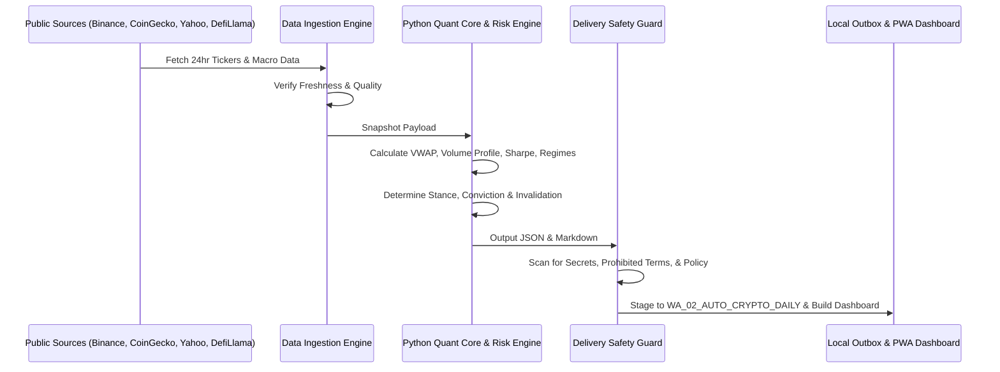

# OpenBagus System Architecture & Design Specification

## 1. Overview & Vision
OpenBagus is an institutional-grade, domain-neutral quantitative intelligence umbrella platform.
The architecture is structured around five core pillars:
1. **Decoupled Domains:** The core computation engines, risk algorithms, and data interfaces know nothing about specific trading assets. Market-specific logic lives strictly within `openbagus/domains/<domain>/`.
2. **Deterministic Python Quant Core:** All numerical decisions, risk metrics, conviction scores, invalidation levels, and portfolio stances are computed using deterministic Python algorithms.
3. **Advisory LLM Layer:** Language models are strictly segregated to interface, narrative summarization, and adversarial critique. They have no write access to quantitative scores.
4. **Safety & Zero-Execution:** Default runtime mode is `NO_SEND_FILE_ONLY`. The platform operates purely as an analytical desk, with zero automated execution hooks.
5. **Universal Ingestion & Freshness Guarantees:** Raw data is captured with explicit timestamps, freshness thresholds, and source attribution. Stale data immediately triggers analysis blocking rather than hallucinating prices.

---

## 2. Package Architecture

### `openbagus.core`
Contains foundational interfaces and generic market algorithms:
- `market_structure.py`: High-performance implementation of Volume-Weighted Average Price (VWAP), multi-bin Volume Profile (POC, VAH, VAL, HVN, LVN), dynamic Support & Resistance detection, and market regime classification (Trending vs Range).
- `guards.py`: Content compliance scanner, secret blocker, and forbidden phrase filter.
- `contracts.py`: Data contracts for asset prices, macro indicators, and analysis results.
- `env.py`: Environment loader, path policy resolver, and directory management.

### `openbagus.domains.crypto`
Domain-specific modeling for digital assets:
- `microstructure.py`: Analyzes perpetual funding rates, orderbook depth proxies, liquidation cluster estimations, and volume delta.
- `order_flow.py`: Cumulative Volume Delta (CVD) tracking and absorption signatures.

### `openbagus.risk`
Quantitative portfolio and risk management tools:
- `metrics.py`: Annualized Sharpe Ratio, Sortino Ratio (downside deviation), Maximum Drawdown (MDD), Value-at-Risk (Parametric & Historical VaR), Conditional Value-at-Risk (CVaR/Expected Shortfall), and Monte Carlo paths.
- `portfolio.py`: Correlation matrices and volatility estimators.

### `openbagus.intelligence`
Explanatory context and narrative processing:
- `macro/scenario.py`: Cross-asset scenario generation combining DXY, VIX, US10Y yields, commodities, and stablecoin liquidity.
- `news/`: Source registry, freshness memory, deduplication, and relevance ranker.
- `sentiment/`: Multi-factor sentiment enricher.
- `llm/`: Prompts and routing for optional advisory critics.

### `openbagus.data`
Data acquisition and persistence:
- `ingestion.py`: Resilient public data collector with retry backoff, multi-endpoint fallbacks (Binance -> CoinGecko), Yahoo Finance chart proxies, DefiLlama stablecoin metrics, and optional DuckDB integration.

### `openbagus.analysis`
Quantitative synthesis engine:
- `engine.py`: Combines data quality, market structure, risk metrics, and macro scenarios into a unified portfolio stance (`Accumulate-on-weakness`, `Hold`, `Watchlist`, `Avoid`) with conviction and actionability scores.

### `openbagus.delivery`
Outbox staging and transmission:
- `runner.py`: Coordinates daily brief staging, macro reports, and dashboard updates.
- `safety.py`: Enforces zero-leakage security, NO_SEND constraints, and trigger validation (`OpenBagus`).

---

## 3. Data Flow Diagram

---

## 4. Domain Neutrality Enforcement
To prevent architectural drift:
- No module inside `openbagus.core` may import from `openbagus.domains`.
- All future domains (e.g., `openbagus.domains.equities`, `openbagus.domains.forex`) must inherit contracts from `openbagus.core.contracts`.
- Core scoring functions accept abstract price and volume time series rather than domain-specific tickers.
